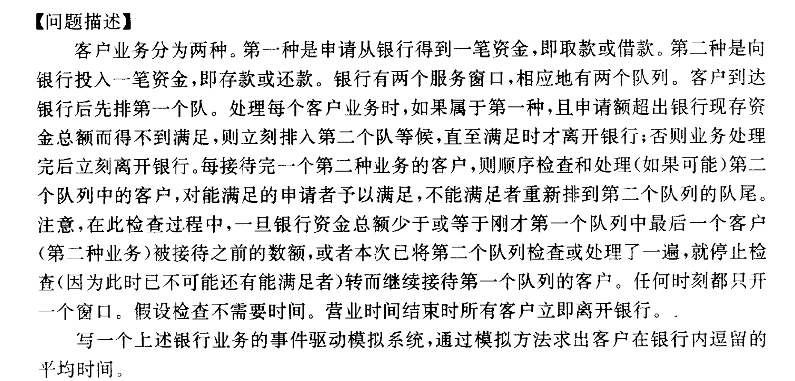

# 离散事件模拟_银行 实验报告
## 实验要求
本次实验要求利用栈，队列和链表等操作，实现一个银行业务的事件驱动模拟系统，并通过模拟的方法求出客户在银行逗留的平均时间。具体题目如下所示：
<center class = "half">
    
</center>
另外，本次实验还有附加题，即完成多个一种队列的服务窗口，通过数字确定数量，在这里我们完成了本次实验的附加项。

## 设计思路
由于本次实验的存储结构是动态存储，需要大量的运用到malloc和free函数，故在此设计的数据结构如下所示：
``` c
struct Event
{
    int OccurTime;
    int NType;         //规定0是到来
    struct Event* next;//方便进行链表的插入
};                      //定义事件类型，包括发生时间与事件种类
```
此为事件的数据结构，定义了事件的发生时间和事件类型，0为到来，非0为从NType号窗口离开，此处有一个特殊的NType类型，在后面介绍函数的时候我们会用到。
``` c
struct Qelem            //代表客户
{
    int ArrivalTime;    //到达时间
    int Duration;       //业务持续时间
    int Amount;         //Amount表示该客户随机的存款或取款的钱数,正数为存款,负数为借款
    int tag;            //标志客户的序列
}
```
这是客户的数据结构，由于客户群满足队列的特征，在此使用Qelem的名称。在这里我们定义了客户的到达时间，业务的处理时间，存取款的数量，还用一个tag标志客户所处的序列。
``` c
struct Queue            //队列，即直观上的窗口队列
{
    struct Qelem* base; //
    int front;
    int rear;
};                      //定义队列，利用循环队列结构(此为取款或还款的队列)
```
这是服务窗口的数据结构，采用通常我们定义的队列形式。在这里为了充分利用空间，我们还用循环队列的操作。
```c
void EnQueue(struct Queue* Q,struct Qelem e)
{
    Q->base[Q->rear] = e;
    Q->rear = (Q->rear+1)%MAXSIZE;
}                       //插入元素到队尾
void Dequeue(struct Queue* Q)
{
    Q->front=(Q->front+1)%MAXSIZE;
}                        //删除队头元素
int QueueLength(struct Queue q)
{
    return (q.rear-q.front+MAXSIZE)%MAXSIZE;
}                           //计算出队列的长度，采用循环队列的方式
int QEmpty(struct Queue *q)
{
    if(q->front==q->rear) return 1;
    else return 0;
}                       //判断是否为空队列，1为空，0为非空
struct Qelem GetHead(struct Queue *q)       //返回一个队列元素，这是该队列的队头元素
{
    struct Qelem temp;
    temp=q->base[q->front];
    return temp;
}
```
这是几种常见的队列操作函数，如队列的插入，删除，计算队列的长度，判断队列是否为空，得到队列的头元素等。
```c
void MoveItToTheLast(struct Queue* Q,int i)     //将第i个元素移向队尾
{
    int m = i;
    int rear = Q->rear;
    EnQueue(Q,Q->base[i]);   //将第i个元素插入队尾，同时rear向后移了一位
    for(;m < Q->rear-1;m++)
    {
        Q->base[i] = Q->base[i+1];
    }
    Q->rear = rear;
}
```
这一函数是将第i个元素移动到队列的末尾。这一函数的使用主要是为了处理0号取款队列，在有客户在其他窗口存款时，对0号队列进行扫描，如果当前客户不满足取款的要求，则将该客户移动到队列末尾。
```c
int TotalTime = 0;   //记录模拟系统客户等待的时间
int CustomerNum = 0;  //记录目前有多少客户来过了
int MoneyNums;         //记录银行的存款
int CloseTime;       //用以设置银行的关门时间
```
接下来我们定义了一些全局变量，如客户等待的总时间，其是为了方便计算之后的平均等待时间，还有客户到达的总量，银行目前的存款金额，还有银行的关门时间。方便在之后的函数中直接更改它们的值。
```c
void Insert(struct Event **head,struct Event *en)    //按事件发生的先后顺序插入，head是事件表的头指针，en是待插入的事件（该事件表无头结点）
{
    struct Event *p=*head;
    if(p==NULL)
    {
        *head=en;
        en->next=NULL;
        return ;
    }
    if(p->OccurTime>en->OccurTime)
    {
        en->next=p;
        *head=en;
        return ;
    }
    while(p->next&&p->next->OccurTime<=en->OccurTime)
    {
        p=p->next;
    }
    en->next=p->next;
    p->next=en;
}
```
这一函数主要是完成事件表的插入，由于事件表的插入满足时间的先后顺序，故该操作与链表的有序插入类似。
```c
int Minimum(struct Queue* q , int nums)      //需判断nums>=2，此函数为求最短队列的序号
{
    int i,res,temp;
    int num[nums];
    for(i=0;i<nums;i++)
    {
        num[i]=QueueLength(*(q+i+1));
    }
    for(res=0,temp=1;temp<nums;temp++)
    {
        if(num[res]>num[temp]) res=temp;
    }
    return res+1;
}
```
这一函数是为了完成客户排队的优化，每当一个客户到达银行=时，他应该最先去寻找一个最短的队列去排队。这一函数就是为了模拟这一情况。
```c
struct Event* OpenForDay()    //模拟系统的开始，返回一个到来事件
{
    TotalTime = 0;          //开始时间置0
    CustomerNum = 0;        //开始人数置0
    struct Event* Come;     //插入一个到来事件
    Come = (struct Event*)malloc(sizeof(struct Event));
    Come->next = NULL;
    Come->NType = 0;
    Come->OccurTime = 0;
    return Come ;           //返回一个事件表的表头
}
```
这一函数是模拟系统的驱动函数，它将推动整个模拟过程的开始。关于模拟系统的函数我将在之后详细介绍它们的原理。
```c
void CustomerArrived(struct Event** head,struct Event* en,struct Queue q[],int nums)  //处理客户到达，前提为en->NType == 0
{
    int durtime;            //需要生成客户的业务办理时间
    int intertime;          //生成下一个客户到来的时间间隔
    int Money;
    int t;
    int i;
    struct Event *en1;      //产生插入的到达事件
    struct Qelem *qel;      //产生队列元素，即客户
    struct Event *en2;
    en1 = (struct Event*)malloc(sizeof(struct Event));
    CustomerNum++;
    durtime = rand()%(50-10+1)+10;
    intertime = rand()%(50-10+1)+10;
    Money = rand()%(1000+1000+1)-1000;
    t = en->OccurTime+intertime ;       //下一个客户到达的时间
    if(t < CloseTime)
    {
        en1 -> OccurTime = t;
        en1 -> NType = 0;
        Insert(head,en1);
    }               //如果该客户到来是在关门之前，则将其插入到事件表
    i = Minimum(q,nums);                //找到最短的队列
    qel = (struct Qelem*)malloc(sizeof(struct Qelem));
    qel->ArrivalTime = en->OccurTime;
    qel->Duration = durtime;
    qel->Amount = Money;
    qel->tag = CustomerNum;     //表明了这是第几个客户
    printf("第%d个客户，到达时间:%d,前往了%d号窗口,想要处理的金额:%d,预期业务需处理的时间:%d\n",qel->tag,en->OccurTime,i,qel->Amount,qel->Duration);
    printf("\n");
    EnQueue(q+i,*qel);
    if(QueueLength(q[i]) == 1 && Money+MoneyNums>=0)          //若只有一个客户且该客户不会使银行资金为负
    {
        en2 = (struct Event*)malloc(sizeof(struct Event));
        en2->OccurTime = en->OccurTime+durtime;
        en2->NType = i;
        Insert(head,en2);
    }                                  //生成一个离开事件
    if(QueueLength(q[i]) == 1 && MoneyNums+Money<0)         //若只有一个客户且该客户会使银行资金为负
    {
        en2 = (struct Event*)malloc(sizeof(struct Event));
        en2->OccurTime = en->OccurTime+durtime;
        en2->NType = i;
        Insert(head,en2);
    }
}
```
这是处理客户到达的函数。
```c
void DealGetque(struct Event** head,struct Event* en,struct Queue q[],int MoneyTemp)
{
    int Length;
    int MoneyNumsTemp = MoneyNums;
    int num = 0;
    Length = QueueLength(q[0]);
    struct Event* en1[Length+1];     //生成离开事件
    int Count = 0;
    en1[Count] = (struct Event*)malloc(sizeof(struct Event));
    *en1[Count] = *en;
    for(int i = q[0].front;i < q[0].rear&&MoneyNumsTemp>=MoneyTemp&&num <= Length;)        //遍历q[0]
    {
        if(q[0].base[i].Amount+MoneyNumsTemp >= 0)
        {
            en1[Count+1] = (struct Event*)malloc(sizeof(struct Event));
            if(en1[Count]->OccurTime+q[0].base[i].Duration <= CloseTime)
            {
                en1[Count+1]->OccurTime = en1[Count]->OccurTime+q[0].base[i].Duration;
            }else
            {
                en1[Count+1]->OccurTime = CloseTime;
            }
            Count++;
            MoneyNumsTemp += q[0].base[i].Amount;
            en1[Count]->NType = 10000;
            Insert(head,en1[Count]);    //产生离开事件
            i++;
            num++;
        }else               //将该元素移动到队尾
        {
            MoveItToTheLast(q,i);
            num++;
        }
    }
}
```
这个函数是为了处理0号队列的取款客户在其他队列有人存款的情况下，他们是否可以取款的操作。
```c
void CustomerDeparture(struct Event** head,struct Event* en,struct Queue q[],int nums)      //处理离开事件，前提是en->NType>0
{
    int i = 1;
    int MoneyTemp;
    struct Event* en1;
    struct Qelem temp;
    struct Qelem qel;
    i = en->NType;
    if(i == 10000)
    {
        if(q[0].base[q[0].front].Amount+MoneyNums >= 0)
        {
            if(en->OccurTime < CloseTime)
            {
                TotalTime += en->OccurTime-q[0].base[q[0].front].ArrivalTime;
                MoneyNums += q[0].base[q[0].front].Amount;
                qel = q[0].base[q[0].front];
                printf("第%d位客人，在%d的系统时间离开,他/她总共的业务时长为%d个单位的时间,处理金额为%d元\n",qel.tag,en->OccurTime,en->OccurTime-q[0].base[q[0].front].ArrivalTime,qel.Amount);
                printf("\n");
                Dequeue(q);
                return ;
            }else
            {
                TotalTime += CloseTime-q[0].base[q[0].front].ArrivalTime;
                printf("第%d位客人在处理业务中,由于银行关闭,被迫离开\n",q[0].base[q[0].front].tag);
                printf("\n");
                Dequeue(q);
                return ;
            }
        }else
        {
            return;
        }
    }
    if(q[i].base[q[i].front].Amount >= 0)           //若该位离开的客户是存款
    {
        if(en->OccurTime < CloseTime)
        {
            MoneyTemp = MoneyNums;          //记录下此时银行所有的存款
            MoneyNums += q[i].base[q[i].front].Amount;
            //下面检索取款队列中是否有可走的,并产生离开事件插入到事件表中
            if(!QEmpty(q))
            {
                DealGetque(head,en,q,MoneyTemp);
            }
            TotalTime += en->OccurTime-q[i].base[q[i].front].ArrivalTime;
            qel = q[i].base[q[i].front];
            printf("第%d位客人，在%d的系统时间离开，他/她总共的业务时长为%d个单位的时间,处理金额为%d元\n",qel.tag,en->OccurTime,en->OccurTime-q[i].base[q[i].front].ArrivalTime,qel.Amount);
            printf("\n");
            Dequeue(q+i);
        }else
        {
            TotalTime += CloseTime-q[i].base[q[i].front].ArrivalTime;
            printf("第%d位客人在处理业务中,由于银行关闭,被迫离开\n",q[i].base[q[i].front].tag);
            printf("\n");
            Dequeue(q+i);
            return ;
        }
        
    }else
    {
        if(en->OccurTime < CloseTime)
        {
            if(MoneyNums+q[i].base[q[i].front].Amount >= 0)
            {
                MoneyNums += q[i].base[q[i].front].Amount;
                TotalTime += en->OccurTime-q[i].base[q[i].front].ArrivalTime;
                qel = q[i].base[q[i].front];
                printf("第%d位客人，在%d的系统时间离开，他/她总共的业务时长为%d个单位的时间,处理金额为%d元\n",qel.tag,en->OccurTime,en->OccurTime-q[i].base[q[i].front].ArrivalTime,qel.Amount);
                printf("\n");
                Dequeue(q+i);
            }else
            {
                TotalTime += en->OccurTime-q[i].base[q[i].front].ArrivalTime;
                q[i].base[q[i].front].ArrivalTime = en->OccurTime;
                printf("第%d位客人离开了,前往了0号取款队列\n",q[i].base[q[i].front].tag);
                printf("\n");
                EnQueue(q,q[i].base[q[i].front]);
                Dequeue(q+i);
            }
        }else
        {
            TotalTime += CloseTime-q[i].base[q[i].front].ArrivalTime;
            printf("第%d位客人在处理业务中,由于银行关闭,被迫离开\n",q[i].base[q[i].front].tag);
            printf("\n");
            Dequeue(q+i);
            return ;
        }
        
    }
    if(!QEmpty(q+i))
    {
        temp=GetHead(q+i);
        en1=(struct Event*)malloc(sizeof(struct Event));
        en1->OccurTime = en->OccurTime+temp.Duration;
        en1->NType=i;
        Insert(head,en1);               //产生下一个离开事件
    }
}
```
这一函数是为了处理客户离开的情况。
下面是main函数：
```c
int main()
{
    struct Event *head = NULL;    //定义事件链表，无头结点
    int nums;                     //nums为有多少条存款队列
    struct Queue *q;
    srand((unsigned)time(NULL));
    printf("请输入银行今天的营业总时间:");
    scanf("%d",&CloseTime);
    printf("请输入银行今天的总资金:");
    scanf("%d",&MoneyNums);
    printf("请输入第一种队列数:");
    scanf("%d",&nums);
    q=(struct Queue*)malloc(sizeof(struct Queue)*(nums+1));      //申请nums+1个队列空间，其中第0个队列为取款队列
    for(int i=0;i<nums+1;i++)
    {
        q[i].base=(struct Qelem*)malloc(sizeof(struct Qelem)*MAXSIZE);
        q[i].front=0;
        q[i].rear=0;
    }
    head = OpenForDay();         //一天开始，第一个客户到达
    while(head)
    {
        struct Event* en;
        en = head;
        head = head->next;
        if(en->NType == 0)
        {
            CustomerArrived(&head,en,q,nums);
        }
        else CustomerDeparture(&head,en,q,nums);
    }
    printf("银行关闭,此时所有人员被迫离开\n");
    printf("\n");
    printf("本次营业总体的平均等待时间为:%f\n",(float)TotalTime/CustomerNum);
    printf("\n");
    return 0;
}
```
该函数调用了之前的处理客户离开到来的函数，完成整个模拟系统。
## 关键代码讲解
下面将讲解帮助银行模拟系统运行的三个关键函数，其中第一个是处理客户到来的函数，代码如下所示。在这个函数中，下一个客户的到来是由上一个客户到来时产生的随机数决定的。一个客户的到来在模拟系统中意味着一个事件产生，这个事件会按照时间顺序插入到事件发生链表。这个事件的NType会被置为0，代表其是一个到来事件。当到来事件发生时，会根据当前的各个窗口的队列长度，选择一个最短的队列进行排队，这种选择也符合实际的情况。这里要处理一种离开事件，即当该队列只有一个客户时，客户的到来同时也会同步产生一个离开事件。这一个离开事件又要分成两种类型，一个是存款或者是成功取款，第二种是取款失败。前者会成功离开，后者会进入0号队列等候取款的机会。
```c
void CustomerArrived(struct Event** head,struct Event* en,struct Queue q[],int nums)  //处理客户到达，前提为en->NType == 0
{
    int durtime;            //需要生成客户的业务办理时间
    int intertime;          //生成下一个客户到来的时间间隔
    int Money;
    int t;
    int i;
    struct Event *en1;      //产生插入的到达事件
    struct Qelem *qel;      //产生队列元素，即客户
    struct Event *en2;
    en1 = (struct Event*)malloc(sizeof(struct Event));
    CustomerNum++;
    durtime = rand()%(50-10+1)+10;
    intertime = rand()%(50-10+1)+10;
    Money = rand()%(1000+1000+1)-1000;
    t = en->OccurTime+intertime ;       //下一个客户到达的时间
    if(t < CloseTime)
    {
        en1 -> OccurTime = t;
        en1 -> NType = 0;
        Insert(head,en1);
    }               //如果该客户到来是在关门之前，则将其插入到事件表
    i = Minimum(q,nums);                //找到最短的队列
    qel = (struct Qelem*)malloc(sizeof(struct Qelem));
    qel->ArrivalTime = en->OccurTime;
    qel->Duration = durtime;
    qel->Amount = Money;
    qel->tag = CustomerNum;     //表明了这是第几个客户
    printf("第%d个客户，到达时间:%d,前往了%d号窗口,想要处理的金额:%d,预期业务需处理的时间:%d\n",qel->tag,en->OccurTime,i,qel->Amount,qel->Duration);
    printf("\n");
    EnQueue(q+i,*qel);
    if(QueueLength(q[i]) == 1 && Money+MoneyNums>=0)          //若只有一个客户且该客户不会使银行资金为负
    {
        en2 = (struct Event*)malloc(sizeof(struct Event));
        en2->OccurTime = en->OccurTime+durtime;
        en2->NType = i;
        Insert(head,en2);
    }                                  //生成一个离开事件
    if(QueueLength(q[i]) == 1 && MoneyNums+Money<0)         //若只有一个客户且该客户会使银行资金为负
    {
        en2 = (struct Event*)malloc(sizeof(struct Event));
        en2->OccurTime = en->OccurTime+durtime;
        en2->NType = i;
        Insert(head,en2);
    }
}
```
第二个关键函数是处理客户离开的函数，函数具体如下所示。在这里函数我们会处理客户的离开事件。这里我们存在一个**NType == 10000**的情况。这个情况是为了针对0号队列的客户离开事件，不过我们发生的同时会进行一步判断，如果存款不支持其发生则直接跳过该事件。另外，为了保证不存在离开事件发生，但银行存款临时被取走而不够的情况，我们在每个事件一发生就更新银行的存款数，这样就解决了事件未发生完毕而银行存款不支持该事件发生。对于非0号队列的离开事件，我们分为存款事件和取款事件。对于取款事件，我们会判断器是否满足取款要求，如果满足则离开，如果不满足则转入0号队列。对于存款事件，该客户一定可以离开，但是同时我们会调用第三个关键函数生成0号队列的取款事件。
```c
void CustomerDeparture(struct Event** head,struct Event* en,struct Queue q[],int nums)      //处理离开事件，前提是en->NType>0
{
    int i = 1;
    int MoneyTemp;
    struct Event* en1;
    struct Qelem temp;
    struct Qelem qel;
    i = en->NType;
    if(i == 10000)
    {
        if(q[0].base[q[0].front].Amount+MoneyNums >= 0)
        {
            if(en->OccurTime < CloseTime)
            {
                TotalTime += en->OccurTime-q[0].base[q[0].front].ArrivalTime;
                MoneyNums += q[0].base[q[0].front].Amount;
                qel = q[0].base[q[0].front];
                printf("第%d位客人，在%d的系统时间离开,他/她总共的业务时长为%d个单位的时间,处理金额为%d元\n",qel.tag,en->OccurTime,en->OccurTime-q[0].base[q[0].front].ArrivalTime,qel.Amount);
                printf("\n");
                Dequeue(q);
                return ;
            }else
            {
                TotalTime += CloseTime-q[0].base[q[0].front].ArrivalTime;
                printf("第%d位客人在处理业务中,由于银行关闭,被迫离开\n",q[0].base[q[0].front].tag);
                printf("\n");
                Dequeue(q);
                return ;
            }
        }else
        {
            return;
        }
    }
    if(q[i].base[q[i].front].Amount >= 0)           //若该位离开的客户是存款
    {
        if(en->OccurTime < CloseTime)
        {
            MoneyTemp = MoneyNums;          //记录下此时银行所有的存款
            MoneyNums += q[i].base[q[i].front].Amount;
            //下面检索取款队列中是否有可走的,并产生离开事件插入到事件表中
            if(!QEmpty(q))
            {
                DealGetque(head,en,q,MoneyTemp);
            }
            TotalTime += en->OccurTime-q[i].base[q[i].front].ArrivalTime;
            qel = q[i].base[q[i].front];
            printf("第%d位客人，在%d的系统时间离开，他/她总共的业务时长为%d个单位的时间,处理金额为%d元\n",qel.tag,en->OccurTime,en->OccurTime-q[i].base[q[i].front].ArrivalTime,qel.Amount);
            printf("\n");
            Dequeue(q+i);
        }else
        {
            TotalTime += CloseTime-q[i].base[q[i].front].ArrivalTime;
            printf("第%d位客人在处理业务中,由于银行关闭,被迫离开\n",q[i].base[q[i].front].tag);
            printf("\n");
            Dequeue(q+i);
            return ;
        }
        
    }else
    {
        if(en->OccurTime < CloseTime)
        {
            if(MoneyNums+q[i].base[q[i].front].Amount >= 0)
            {
                MoneyNums += q[i].base[q[i].front].Amount;
                TotalTime += en->OccurTime-q[i].base[q[i].front].ArrivalTime;
                qel = q[i].base[q[i].front];
                printf("第%d位客人，在%d的系统时间离开，他/她总共的业务时长为%d个单位的时间,处理金额为%d元\n",qel.tag,en->OccurTime,en->OccurTime-q[i].base[q[i].front].ArrivalTime,qel.Amount);
                printf("\n");
                Dequeue(q+i);
            }else
            {
                TotalTime += en->OccurTime-q[i].base[q[i].front].ArrivalTime;
                q[i].base[q[i].front].ArrivalTime = en->OccurTime;
                printf("第%d位客人离开了,前往了0号取款队列\n",q[i].base[q[i].front].tag);
                printf("\n");
                EnQueue(q,q[i].base[q[i].front]);
                Dequeue(q+i);
            }
        }else
        {
            TotalTime += CloseTime-q[i].base[q[i].front].ArrivalTime;
            printf("第%d位客人在处理业务中,由于银行关闭,被迫离开\n",q[i].base[q[i].front].tag);
            printf("\n");
            Dequeue(q+i);
            return ;
        }
        
    }
    if(!QEmpty(q+i))
    {
        temp=GetHead(q+i);
        en1=(struct Event*)malloc(sizeof(struct Event));
        en1->OccurTime = en->OccurTime+temp.Duration;
        en1->NType=i;
        Insert(head,en1);               //产生下一个离开事件
    }
}
```
下面我们介绍第三个关键函数：处理0号队列的函数。这个函数在第二个关键函数出被调用。当有客户存款之后，该函数会扫描0号队列，对于能够取款的客户，我们将他排到队头，并生成离开事件。而对于不满足这种情况的客户，我们将其移动至队尾即可。
```c
void DealGetque(struct Event** head,struct Event* en,struct Queue q[],int MoneyTemp)
{
    int Length;
    int MoneyNumsTemp = MoneyNums;
    int num = 0;
    Length = QueueLength(q[0]);
    struct Event* en1[Length+1];     //生成离开事件
    int Count = 0;
    en1[Count] = (struct Event*)malloc(sizeof(struct Event));
    *en1[Count] = *en;
    for(int i = q[0].front;i < q[0].rear&&MoneyNumsTemp>=MoneyTemp&&num <= Length;)        //遍历q[0]
    {
        if(q[0].base[i].Amount+MoneyNumsTemp >= 0)
        {
            en1[Count+1] = (struct Event*)malloc(sizeof(struct Event));
            if(en1[Count]->OccurTime+q[0].base[i].Duration <= CloseTime)
            {
                en1[Count+1]->OccurTime = en1[Count]->OccurTime+q[0].base[i].Duration;
            }else
            {
                en1[Count+1]->OccurTime = CloseTime;
            }
            Count++;
            MoneyNumsTemp += q[0].base[i].Amount;
            en1[Count]->NType = 10000;
            Insert(head,en1[Count]);    //产生离开事件
            i++;
            num++;
        }else               //将该元素移动到队尾
        {
            MoveItToTheLast(q,i);
            num++;
        }
    }
}
```
而为了约束事件的发生都在银行的营业时间范围内，我在上述函数的每一个事件发生的同时判断了其是否会超过银行的营业时间，如果超过了营业时间则整个模拟系统终止，银行停止营业。为了统计营业的总时间，我们在每次客户办理业务时，通过客户数据结构定义的业务处理时间计算累加得到。

对于多队列的加分项，我们采用malloc()，让客户每次到来时选择最短的队列进行排队，
## 调试分析
该项目在完成的过程中遇到的主要bug为内存访问越界，即出现咯大量的segmentation fault。segmentation fault的错误主要集中在链表的操作一块，由于该链表没有头节点，而是采用头指针的方式，故在一开始出现了许多内存非法访问的情况。另外在等候队列一处，由于代码不严谨，导致0号队列的操作出现了许多问题。如下面：
```c
void DealGetque(struct Event** head,struct Event* en,struct Queue q[],int MoneyTemp)
{
    int Length;
    int MoneyNumsTemp = MoneyNums;
    int num = 0;
    Length = QueueLength(q[0]);
    struct Event* en1[Length+1];     //生成离开事件
    int Count = 0;
    en1[Count] = (struct Event*)malloc(sizeof(struct Event));
    *en1[Count] = *en;
    for(int i = q[0].front;i < q[0].rear&&MoneyNumsTemp>=MoneyTemp&&num <= Length;)        //遍历q[0]
    {
        if(q[0].base[i].Amount+MoneyNumsTemp >= 0)
        {
            en1[Count+1] = (struct Event*)malloc(sizeof(struct Event));
            if(en1[Count]->OccurTime+q[0].base[i].Duration <= CloseTime)
            {
                en1[Count+1]->OccurTime = en1[Count]->OccurTime+q[0].base[i].Duration;
            }else
            {
                en1[Count+1]->OccurTime = CloseTime;
            }
            Count++;
            MoneyNumsTemp += q[0].base[i].Amount;
            en1[Count]->NType = 10000;
            Insert(head,en1[Count]);    //产生离开事件
            i++;
            num++;
        }else               //将该元素移动到队尾
        {
            MoveItToTheLast(q,i);
            num++;
        }
    }
}
```
这是正确的代码，但在之前，在MoveItToTheLast()函数之后，没有更新跳出循环的条件，这样就导致了代码一直在将0号队列的元素放置队尾，一直循环，导致程序卡死。另外出现的bug是在客户离开函数中，处理0号队列的离开事件没有判断资金是否充足，故导致银行的资金为负，模拟出来的结果不正确。

下面我们来分析一下代码的时间空间复杂度。我们将对于该模拟系统的每个函数逐一分析。对于队列的操作函数来说，由于过多，我们就不逐一分析，大部分队列操作函数的时间复杂度是O(1)，同时不会需要额外的空间。值得注意的是几个队列操作函数，如Minimum(),由于它要遍历一遍队列，它的时间复杂度是O(n),空间复杂度是O(n)。对于MoveItToTheLast()来说，它的时间复杂度为O(n)，空间复杂度为O(1)。而对于三个模拟系统的关键操作函数来说，第一个函数CustomrtArrived()，它的时间复杂度如果用时间Totaltime来衡量的话，为O(n)的级别，它的空间复杂度为也为O(n)。对于DealGetque()函数来说，它的时间复杂度为O($n^2$)，它的空间复杂度为O(n)，对于CustomerDeparture()来说，它的时间复杂度为O($n^2$)，它的空间复杂度为O(n)。
故对于整个函数来说，时间复杂度在O($n^2$)级别，空间复杂度在O(n)级别的。
## 代码测试
下面附上代码的测试结果：
```txt
请输入银行今天的营业总时间:3000
请输入银行今天的总资金:5000
请输入第一种队列数:1
第1个客户，到达时间:0,前往了1号窗口,想要处理的金额:-250,预期业务需处理的时间:12

第1位客人，在12的系统时间离开，他/她总共的业务时长为12个单位的时间,处理金额为-250元

第2个客户，到达时间:23,前往了1号窗口,想要处理的金额:-114,预期业务需处理的时间:33

第3个客户，到达时间:39,前往了1号窗口,想要处理的金额:-614,预期业务需处理的时间:18

第2位客人，在56的系统时间离开，他/她总共的业务时长为33个单位的时间,处理金额为-114元

第3位客人，在74的系统时间离开，他/她总共的业务时长为35个单位的时间,处理金额为-614元

第4个客户，到达时间:89,前往了1号窗口,想要处理的金额:972,预期业务需处理的时间:37

第5个客户，到达时间:101,前往了1号窗口,想要处理的金额:-551,预期业务需处理的时间:35

第6个客户，到达时间:118,前往了1号窗口,想要处理的金额:19,预期业务需处理的时间:27

第4位客人，在126的系统时间离开，他/她总共的业务时长为37个单位的时间,处理金额为972元

第7个客户，到达时间:156,前往了1号窗口,想要处理的金额:-935,预期业务需处理的时间:28

第5位客人，在161的系统时间离开，他/她总共的业务时长为60个单位的时间,处理金额为-551元

第8个客户，到达时间:171,前往了1号窗口,想要处理的金额:980,预期业务需处理的时间:25

第6位客人，在188的系统时间离开，他/她总共的业务时长为70个单位的时间,处理金额为19元

第9个客户，到达时间:207,前往了1号窗口,想要处理的金额:-56,预期业务需处理的时间:32

第7位客人，在216的系统时间离开，他/她总共的业务时长为60个单位的时间,处理金额为-935元

第8位客人，在241的系统时间离开，他/她总共的业务时长为70个单位的时间,处理金额为980元

第10个客户，到达时间:251,前往了1号窗口,想要处理的金额:268,预期业务需处理的时间:44

第9位客人，在273的系统时间离开，他/她总共的业务时长为66个单位的时间,处理金额为-56元

第11个客户，到达时间:286,前往了1号窗口,想要处理的金额:-622,预期业务需处理的时间:33

第10位客人，在317的系统时间离开，他/她总共的业务时长为66个单位的时间,处理金额为268元

第12个客户，到达时间:319,前往了1号窗口,想要处理的金额:219,预期业务需处理的时间:22

第11位客人，在350的系统时间离开，他/她总共的业务时长为64个单位的时间,处理金额为-622元

第13个客户，到达时间:353,前往了1号窗口,想要处理的金额:-776,预期业务需处理的时间:23

第12位客人，在372的系统时间离开，他/她总共的业务时长为53个单位的时间,处理金额为219元

第14个客户，到达时间:391,前往了1号窗口,想要处理的金额:-142,预期业务需处理的时间:25

第13位客人，在395的系统时间离开，他/她总共的业务时长为42个单位的时间,处理金额为-776元

第15个客户，到达时间:409,前往了1号窗口,想要处理的金额:740,预期业务需处理的时间:12

第14位客人，在420的系统时间离开，他/她总共的业务时长为29个单位的时间,处理金额为-142元

第15位客人，在432的系统时间离开，他/她总共的业务时长为23个单位的时间,处理金额为740元

第16个客户，到达时间:451,前往了1号窗口,想要处理的金额:-811,预期业务需处理的时间:22

第16位客人，在473的系统时间离开，他/她总共的业务时长为22个单位的时间,处理金额为-811元

第17个客户，到达时间:487,前往了1号窗口,想要处理的金额:-74,预期业务需处理的时间:28

第18个客户，到达时间:502,前往了1号窗口,想要处理的金额:326,预期业务需处理的时间:39

第17位客人，在515的系统时间离开，他/她总共的业务时长为28个单位的时间,处理金额为-74元

第19个客户，到达时间:524,前往了1号窗口,想要处理的金额:190,预期业务需处理的时间:32

第20个客户，到达时间:534,前往了1号窗口,想要处理的金额:-391,预期业务需处理的时间:21

第21个客户，到达时间:549,前往了1号窗口,想要处理的金额:518,预期业务需处理的时间:28

第18位客人，在554的系统时间离开，他/她总共的业务时长为52个单位的时间,处理金额为326元

第22个客户，到达时间:570,前往了1号窗口,想要处理的金额:162,预期业务需处理的时间:42

第19位客人，在586的系统时间离开，他/她总共的业务时长为62个单位的时间,处理金额为190元

第20位客人，在607的系统时间离开，他/她总共的业务时长为73个单位的时间,处理金额为-391元

第23个客户，到达时间:613,前往了1号窗口,想要处理的金额:-876,预期业务需处理的时间:25

第24个客户，到达时间:624,前往了1号窗口,想要处理的金额:25,预期业务需处理的时间:49

第21位客人，在635的系统时间离开，他/她总共的业务时长为86个单位的时间,处理金额为518元

第25个客户，到达时间:659,前往了1号窗口,想要处理的金额:960,预期业务需处理的时间:50

第22位客人，在677的系统时间离开，他/她总共的业务时长为107个单位的时间,处理金额为162元

第26个客户，到达时间:695,前往了1号窗口,想要处理的金额:122,预期业务需处理的时间:36

第23位客人，在702的系统时间离开，他/她总共的业务时长为89个单位的时间,处理金额为-876元

第27个客户，到达时间:739,前往了1号窗口,想要处理的金额:-292,预期业务需处理的时间:40

第24位客人，在751的系统时间离开，他/她总共的业务时长为127个单位的时间,处理金额为25元

第28个客户，到达时间:765,前往了1号窗口,想要处理的金额:880,预期业务需处理的时间:19

第29个客户，到达时间:790,前往了1号窗口,想要处理的金额:-285,预期业务需处理的时间:13

第25位客人，在801的系统时间离开，他/她总共的业务时长为142个单位的时间,处理金额为960元

第30个客户，到达时间:809,前往了1号窗口,想要处理的金额:665,预期业务需处理的时间:17

第31个客户，到达时间:836,前往了1号窗口,想要处理的金额:-112,预期业务需处理的时间:50

第26位客人，在837的系统时间离开，他/她总共的业务时长为142个单位的时间,处理金额为122元

第32个客户，到达时间:859,前往了1号窗口,想要处理的金额:577,预期业务需处理的时间:20

第27位客人，在877的系统时间离开，他/她总共的业务时长为138个单位的时间,处理金额为-292元

第33个客户，到达时间:889,前往了1号窗口,想要处理的金额:-822,预期业务需处理的时间:49

第28位客人，在896的系统时间离开，他/她总共的业务时长为131个单位的时间,处理金额为880元

第29位客人，在909的系统时间离开，他/她总共的业务时长为119个单位的时间,处理金额为-285元

第30位客人，在926的系统时间离开，他/她总共的业务时长为117个单位的时间,处理金额为665元

第34个客户，到达时间:933,前往了1号窗口,想要处理的金额:-224,预期业务需处理的时间:18

第35个客户，到达时间:954,前往了1号窗口,想要处理的金额:572,预期业务需处理的时间:18

第31位客人，在976的系统时间离开，他/她总共的业务时长为140个单位的时间,处理金额为-112元

第36个客户，到达时间:987,前往了1号窗口,想要处理的金额:-601,预期业务需处理的时间:40

第32位客人，在996的系统时间离开，他/她总共的业务时长为137个单位的时间,处理金额为577元

第37个客户，到达时间:1004,前往了1号窗口,想要处理的金额:-844,预期业务需处理的时间:14

第38个客户，到达时间:1026,前往了1号窗口,想要处理的金额:245,预期业务需处理的时间:27

第33位客人，在1045的系统时间离开，他/她总共的业务时长为156个单位的时间,处理金额为-822元

第34位客人，在1063的系统时间离开，他/她总共的业务时长为130个单位的时间,处理金额为-224元

第39个客户，到达时间:1073,前往了1号窗口,想要处理的金额:158,预期业务需处理的时间:50

第35位客人，在1081的系统时间离开，他/她总共的业务时长为127个单位的时间,处理金额为572元

第40个客户，到达时间:1100,前往了1号窗口,想要处理的金额:-708,预期业务需处理的时间:12

第36位客人，在1121的系统时间离开，他/她总共的业务时长为134个单位的时间,处理金额为-601元

第41个客户，到达时间:1124,前往了1号窗口,想要处理的金额:375,预期业务需处理的时间:16

第37位客人，在1135的系统时间离开，他/她总共的业务时长为131个单位的时间,处理金额为-844元

第42个客户，到达时间:1153,前往了1号窗口,想要处理的金额:25,预期业务需处理的时间:15

第38位客人，在1162的系统时间离开，他/她总共的业务时长为136个单位的时间,处理金额为245元

第43个客户，到达时间:1170,前往了1号窗口,想要处理的金额:-183,预期业务需处理的时间:50

第44个客户，到达时间:1181,前往了1号窗口,想要处理的金额:940,预期业务需处理的时间:28

第45个客户，到达时间:1207,前往了1号窗口,想要处理的金额:19,预期业务需处理的时间:10

第39位客人，在1212的系统时间离开，他/她总共的业务时长为139个单位的时间,处理金额为158元

第40位客人，在1224的系统时间离开，他/她总共的业务时长为124个单位的时间,处理金额为-708元

第46个客户，到达时间:1228,前往了1号窗口,想要处理的金额:-761,预期业务需处理的时间:42

第41位客人，在1240的系统时间离开，他/她总共的业务时长为116个单位的时间,处理金额为375元

第42位客人，在1255的系统时间离开，他/她总共的业务时长为102个单位的时间,处理金额为25元

第47个客户，到达时间:1257,前往了1号窗口,想要处理的金额:556,预期业务需处理的时间:18

第48个客户，到达时间:1271,前往了1号窗口,想要处理的金额:-269,预期业务需处理的时间:42

第49个客户，到达时间:1293,前往了1号窗口,想要处理的金额:439,预期业务需处理的时间:14

第43位客人，在1305的系统时间离开，他/她总共的业务时长为135个单位的时间,处理金额为-183元

第44位客人，在1333的系统时间离开，他/她总共的业务时长为152个单位的时间,处理金额为940元

第50个客户，到达时间:1341,前往了1号窗口,想要处理的金额:919,预期业务需处理的时间:26

第45位客人，在1343的系统时间离开，他/她总共的业务时长为136个单位的时间,处理金额为19元

第46位客人，在1385的系统时间离开，他/她总共的业务时长为157个单位的时间,处理金额为-761元

第51个客户，到达时间:1386,前往了1号窗口,想要处理的金额:593,预期业务需处理的时间:38

第47位客人，在1403的系统时间离开，他/她总共的业务时长为146个单位的时间,处理金额为556元

第52个客户，到达时间:1422,前往了1号窗口,想要处理的金额:197,预期业务需处理的时间:39

第48位客人，在1445的系统时间离开，他/她总共的业务时长为174个单位的时间,处理金额为-269元

第53个客户，到达时间:1451,前往了1号窗口,想要处理的金额:109,预期业务需处理的时间:40

第49位客人，在1459的系统时间离开，他/她总共的业务时长为166个单位的时间,处理金额为439元

第50位客人，在1485的系统时间离开，他/她总共的业务时长为144个单位的时间,处理金额为919元

第54个客户，到达时间:1493,前往了1号窗口,想要处理的金额:972,预期业务需处理的时间:30

第55个客户，到达时间:1508,前往了1号窗口,想要处理的金额:989,预期业务需处理的时间:22

第51位客人，在1523的系统时间离开，他/她总共的业务时长为137个单位的时间,处理金额为593元

第56个客户，到达时间:1540,前往了1号窗口,想要处理的金额:144,预期业务需处理的时间:15

第57个客户，到达时间:1555,前往了1号窗口,想要处理的金额:-991,预期业务需处理的时间:10

第52位客人，在1562的系统时间离开，他/她总共的业务时长为140个单位的时间,处理金额为197元

第58个客户，到达时间:1599,前往了1号窗口,想要处理的金额:73,预期业务需处理的时间:11

第53位客人，在1602的系统时间离开，他/她总共的业务时长为151个单位的时间,处理金额为109元

第59个客户，到达时间:1617,前往了1号窗口,想要处理的金额:-609,预期业务需处理的时间:23

第54位客人，在1632的系统时间离开，他/她总共的业务时长为139个单位的时间,处理金额为972元

第55位客人，在1654的系统时间离开，他/她总共的业务时长为146个单位的时间,处理金额为989元

第60个客户，到达时间:1664,前往了1号窗口,想要处理的金额:900,预期业务需处理的时间:48

第56位客人，在1669的系统时间离开，他/她总共的业务时长为129个单位的时间,处理金额为144元

第57位客人，在1679的系统时间离开，他/她总共的业务时长为124个单位的时间,处理金额为-991元

第61个客户，到达时间:1681,前往了1号窗口,想要处理的金额:623,预期业务需处理的时间:34

第58位客人，在1690的系统时间离开，他/她总共的业务时长为91个单位的时间,处理金额为73元

第59位客人，在1713的系统时间离开，他/她总共的业务时长为96个单位的时间,处理金额为-609元

第62个客户，到达时间:1719,前往了1号窗口,想要处理的金额:549,预期业务需处理的时间:34

第60位客人，在1761的系统时间离开，他/她总共的业务时长为97个单位的时间,处理金额为900元

第63个客户，到达时间:1767,前往了1号窗口,想要处理的金额:618,预期业务需处理的时间:17

第64个客户，到达时间:1781,前往了1号窗口,想要处理的金额:203,预期业务需处理的时间:39

第61位客人，在1795的系统时间离开，他/她总共的业务时长为114个单位的时间,处理金额为623元

第65个客户，到达时间:1819,前往了1号窗口,想要处理的金额:-650,预期业务需处理的时间:24

第62位客人，在1829的系统时间离开，他/她总共的业务时长为110个单位的时间,处理金额为549元

第63位客人，在1846的系统时间离开，他/她总共的业务时长为79个单位的时间,处理金额为618元

第66个客户，到达时间:1848,前往了1号窗口,想要处理的金额:180,预期业务需处理的时间:42

第67个客户，到达时间:1879,前往了1号窗口,想要处理的金额:-284,预期业务需处理的时间:30

第64位客人，在1885的系统时间离开，他/她总共的业务时长为104个单位的时间,处理金额为203元

第68个客户，到达时间:1889,前往了1号窗口,想要处理的金额:-532,预期业务需处理的时间:43

第65位客人，在1909的系统时间离开，他/她总共的业务时长为90个单位的时间,处理金额为-650元

第69个客户，到达时间:1934,前往了1号窗口,想要处理的金额:-815,预期业务需处理的时间:39

第66位客人，在1951的系统时间离开，他/她总共的业务时长为103个单位的时间,处理金额为180元

第70个客户，到达时间:1963,前往了1号窗口,想要处理的金额:-409,预期业务需处理的时间:48

第71个客户，到达时间:1976,前往了1号窗口,想要处理的金额:-550,预期业务需处理的时间:45

第67位客人，在1981的系统时间离开，他/她总共的业务时长为102个单位的时间,处理金额为-284元

第72个客户，到达时间:1990,前往了1号窗口,想要处理的金额:-766,预期业务需处理的时间:15

第73个客户，到达时间:2019,前往了1号窗口,想要处理的金额:-91,预期业务需处理的时间:17

第68位客人，在2024的系统时间离开，他/她总共的业务时长为135个单位的时间,处理金额为-532元

第74个客户，到达时间:2042,前往了1号窗口,想要处理的金额:550,预期业务需处理的时间:35

第69位客人，在2063的系统时间离开，他/她总共的业务时长为129个单位的时间,处理金额为-815元

第75个客户，到达时间:2069,前往了1号窗口,想要处理的金额:-699,预期业务需处理的时间:30

第70位客人，在2111的系统时间离开，他/她总共的业务时长为148个单位的时间,处理金额为-409元

第76个客户，到达时间:2116,前往了1号窗口,想要处理的金额:292,预期业务需处理的时间:40

第71位客人，在2156的系统时间离开，他/她总共的业务时长为180个单位的时间,处理金额为-550元

第77个客户，到达时间:2158,前往了1号窗口,想要处理的金额:692,预期业务需处理的时间:21

第72位客人，在2171的系统时间离开，他/她总共的业务时长为181个单位的时间,处理金额为-766元

第78个客户，到达时间:2179,前往了1号窗口,想要处理的金额:176,预期业务需处理的时间:21

第73位客人，在2188的系统时间离开，他/她总共的业务时长为169个单位的时间,处理金额为-91元

第79个客户，到达时间:2208,前往了1号窗口,想要处理的金额:747,预期业务需处理的时间:36

第74位客人，在2223的系统时间离开，他/她总共的业务时长为181个单位的时间,处理金额为550元

第75位客人，在2253的系统时间离开，他/她总共的业务时长为184个单位的时间,处理金额为-699元

第80个客户，到达时间:2256,前往了1号窗口,想要处理的金额:399,预期业务需处理的时间:28

第81个客户，到达时间:2280,前往了1号窗口,想要处理的金额:233,预期业务需处理的时间:11

第76位客人，在2293的系统时间离开，他/她总共的业务时长为177个单位的时间,处理金额为292元

第82个客户，到达时间:2312,前往了1号窗口,想要处理的金额:-166,预期业务需处理的时间:34

第77位客人，在2314的系统时间离开，他/她总共的业务时长为156个单位的时间,处理金额为692元

第83个客户，到达时间:2329,前往了1号窗口,想要处理的金额:257,预期业务需处理的时间:25

第78位客人，在2335的系统时间离开，他/她总共的业务时长为156个单位的时间,处理金额为176元

第84个客户，到达时间:2340,前往了1号窗口,想要处理的金额:-281,预期业务需处理的时间:46

第79位客人，在2371的系统时间离开，他/她总共的业务时长为163个单位的时间,处理金额为747元

第85个客户，到达时间:2373,前往了1号窗口,想要处理的金额:-356,预期业务需处理的时间:43

第80位客人，在2399的系统时间离开，他/她总共的业务时长为143个单位的时间,处理金额为399元

第86个客户，到达时间:2402,前往了1号窗口,想要处理的金额:-813,预期业务需处理的时间:44

第81位客人，在2410的系统时间离开，他/她总共的业务时长为130个单位的时间,处理金额为233元

第82位客人，在2444的系统时间离开，他/她总共的业务时长为132个单位的时间,处理金额为-166元

第87个客户，到达时间:2447,前往了1号窗口,想要处理的金额:392,预期业务需处理的时间:29

第83位客人，在2469的系统时间离开，他/她总共的业务时长为140个单位的时间,处理金额为257元

第88个客户，到达时间:2485,前往了1号窗口,想要处理的金额:361,预期业务需处理的时间:41

第89个客户，到达时间:2506,前往了1号窗口,想要处理的金额:-562,预期业务需处理的时间:13

第84位客人，在2515的系统时间离开，他/她总共的业务时长为175个单位的时间,处理金额为-281元

第90个客户，到达时间:2523,前往了1号窗口,想要处理的金额:-516,预期业务需处理的时间:22

第91个客户，到达时间:2553,前往了1号窗口,想要处理的金额:-932,预期业务需处理的时间:47

第85位客人，在2558的系统时间离开，他/她总共的业务时长为185个单位的时间,处理金额为-356元

第92个客户，到达时间:2599,前往了1号窗口,想要处理的金额:-653,预期业务需处理的时间:39

第86位客人，在2602的系统时间离开，他/她总共的业务时长为200个单位的时间,处理金额为-813元

第93个客户，到达时间:2619,前往了1号窗口,想要处理的金额:-901,预期业务需处理的时间:21

第87位客人，在2631的系统时间离开，他/她总共的业务时长为184个单位的时间,处理金额为392元

第94个客户，到达时间:2659,前往了1号窗口,想要处理的金额:-419,预期业务需处理的时间:16

第88位客人，在2672的系统时间离开，他/她总共的业务时长为187个单位的时间,处理金额为361元

第89位客人，在2685的系统时间离开，他/她总共的业务时长为179个单位的时间,处理金额为-562元

第95个客户，到达时间:2701,前往了1号窗口,想要处理的金额:-332,预期业务需处理的时间:32

第90位客人，在2707的系统时间离开，他/她总共的业务时长为184个单位的时间,处理金额为-516元

第96个客户，到达时间:2714,前往了1号窗口,想要处理的金额:750,预期业务需处理的时间:34

第91位客人，在2754的系统时间离开，他/她总共的业务时长为201个单位的时间,处理金额为-932元

第97个客户，到达时间:2764,前往了1号窗口,想要处理的金额:243,预期业务需处理的时间:43

第92位客人，在2793的系统时间离开，他/她总共的业务时长为194个单位的时间,处理金额为-653元

第98个客户，到达时间:2794,前往了1号窗口,想要处理的金额:67,预期业务需处理的时间:11

第93位客人，在2814的系统时间离开，他/她总共的业务时长为195个单位的时间,处理金额为-901元

第99个客户，到达时间:2818,前往了1号窗口,想要处理的金额:682,预期业务需处理的时间:26

第94位客人，在2830的系统时间离开，他/她总共的业务时长为171个单位的时间,处理金额为-419元

第100个客户，到达时间:2843,前往了1号窗口,想要处理的金额:613,预期业务需处理的时间:36

第95位客人，在2862的系统时间离开，他/她总共的业务时长为161个单位的时间,处理金额为-332元

第101个客户，到达时间:2874,前往了1号窗口,想要处理的金额:-205,预期业务需处理的时间:20

第96位客人，在2896的系统时间离开，他/她总共的业务时长为182个单位的时间,处理金额为750元

第102个客户，到达时间:2907,前往了1号窗口,想要处理的金额:493,预期业务需处理的时间:31

第97位客人，在2939的系统时间离开，他/她总共的业务时长为175个单位的时间,处理金额为243元

第103个客户，到达时间:2945,前往了1号窗口,想要处理的金额:944,预期业务需处理的时间:45

第98位客人，在2950的系统时间离开，他/她总共的业务时长为156个单位的时间,处理金额为67元

第104个客户，到达时间:2964,前往了1号窗口,想要处理的金额:210,预期业务需处理的时间:32

第99位客人，在2976的系统时间离开，他/她总共的业务时长为158个单位的时间,处理金额为682元

第100位客人在处理业务中,由于银行关闭,被迫离开

银行关闭,此时所有人员被迫离开

本次营业总体的平均等待时间为:119.586540
```
这个是第一种队列数为1，银行存款数为5000的情况。下面我们来测试银行存款为0的情况，我们测试两种极端样例，即第一种队列数很多和第一种队列数很少。下面附上测试结果：
```txt
请输入银行今天的营业总时间:1000
请输入银行今天的总资金:0
请输入第一种队列数:90
第1个客户，到达时间:0,前往了1号窗口,想要处理的金额:70,预期业务需处理的时间:50

第2个客户，到达时间:23,前往了2号窗口,想要处理的金额:-637,预期业务需处理的时间:21

第3个客户，到达时间:41,前往了3号窗口,想要处理的金额:22,预期业务需处理的时间:37

第2位客人离开了,前往了0号取款队列

第1位客人，在50的系统时间离开，他/她总共的业务时长为50个单位的时间,处理金额为70元

第3位客人，在78的系统时间离开，他/她总共的业务时长为37个单位的时间,处理金额为22元

第4个客户，到达时间:84,前往了1号窗口,想要处理的金额:-600,预期业务需处理的时间:36

第4位客人离开了,前往了0号取款队列

第5个客户，到达时间:121,前往了1号窗口,想要处理的金额:991,预期业务需处理的时间:14

第5位客人，在135的系统时间离开，他/她总共的业务时长为14个单位的时间,处理金额为991元

第2位客人，在156的系统时间离开,他/她总共的业务时长为112个单位的时间,处理金额为-637元

第6个客户，到达时间:164,前往了1号窗口,想要处理的金额:-734,预期业务需处理的时间:44

第7个客户，到达时间:189,前往了2号窗口,想要处理的金额:-545,预期业务需处理的时间:19

第6位客人离开了,前往了0号取款队列

第7位客人离开了,前往了0号取款队列

第8个客户，到达时间:236,前往了1号窗口,想要处理的金额:41,预期业务需处理的时间:33

第9个客户，到达时间:263,前往了2号窗口,想要处理的金额:176,预期业务需处理的时间:30

第8位客人，在269的系统时间离开，他/她总共的业务时长为33个单位的时间,处理金额为41元

第9位客人，在293的系统时间离开，他/她总共的业务时长为30个单位的时间,处理金额为176元

第10个客户，到达时间:311,前往了1号窗口,想要处理的金额:-657,预期业务需处理的时间:13

第11个客户，到达时间:324,前往了2号窗口,想要处理的金额:-527,预期业务需处理的时间:34

第10位客人，在324的系统时间离开，他/她总共的业务时长为13个单位的时间,处理金额为-657元

第11位客人离开了,前往了0号取款队列

第12个客户，到达时间:365,前往了1号窗口,想要处理的金额:-658,预期业务需处理的时间:10

第12位客人离开了,前往了0号取款队列

第13个客户，到达时间:390,前往了1号窗口,想要处理的金额:717,预期业务需处理的时间:13

第13位客人，在403的系统时间离开，他/她总共的业务时长为13个单位的时间,处理金额为717元

第14个客户，到达时间:411,前往了1号窗口,想要处理的金额:679,预期业务需处理的时间:12

第14位客人，在423的系统时间离开，他/她总共的业务时长为12个单位的时间,处理金额为679元

第15个客户，到达时间:448,前往了1号窗口,想要处理的金额:-18,预期业务需处理的时间:41

第6位客人，在467的系统时间离开,他/她总共的业务时长为259个单位的时间,处理金额为-734元

第15位客人，在489的系统时间离开，他/她总共的业务时长为41个单位的时间,处理金额为-18元

第16个客户，到达时间:493,前往了1号窗口,想要处理的金额:719,预期业务需处理的时间:33

第17个客户，到达时间:507,前往了2号窗口,想要处理的金额:-4,预期业务需处理的时间:23

第18个客户，到达时间:524,前往了3号窗口,想要处理的金额:238,预期业务需处理的时间:49

第16位客人，在526的系统时间离开，他/她总共的业务时长为33个单位的时间,处理金额为719元

第17位客人，在530的系统时间离开，他/她总共的业务时长为23个单位的时间,处理金额为-4元

第19个客户，到达时间:547,前往了1号窗口,想要处理的金额:-250,预期业务需处理的时间:26

第6位客人，在570的系统时间离开,他/她总共的业务时长为362个单位的时间,处理金额为-734元

第20个客户，到达时间:572,前往了2号窗口,想要处理的金额:753,预期业务需处理的时间:49

第18位客人，在573的系统时间离开，他/她总共的业务时长为49个单位的时间,处理金额为238元

第19位客人，在573的系统时间离开，他/她总共的业务时长为26个单位的时间,处理金额为-250元

第7位客人，在592的系统时间离开,他/她总共的业务时长为384个单位的时间,处理金额为-545元

第21个客户，到达时间:621,前往了1号窗口,想要处理的金额:124,预期业务需处理的时间:31

第20位客人，在621的系统时间离开，他/她总共的业务时长为49个单位的时间,处理金额为753元

第22个客户，到达时间:649,前往了2号窗口,想要处理的金额:-754,预期业务需处理的时间:19

第21位客人，在652的系统时间离开，他/她总共的业务时长为31个单位的时间,处理金额为124元

第11位客人，在655的系统时间离开,他/她总共的业务时长为297个单位的时间,处理金额为-527元

第22位客人离开了,前往了0号取款队列

第23个客户，到达时间:689,前往了1号窗口,想要处理的金额:267,预期业务需处理的时间:44

第24个客户，到达时间:729,前往了2号窗口,想要处理的金额:110,预期业务需处理的时间:40

第23位客人，在733的系统时间离开，他/她总共的业务时长为44个单位的时间,处理金额为267元

第25个客户，到达时间:742,前往了1号窗口,想要处理的金额:961,预期业务需处理的时间:25

第12位客人，在743的系统时间离开,他/她总共的业务时长为368个单位的时间,处理金额为-658元

第25位客人，在767的系统时间离开，他/她总共的业务时长为25个单位的时间,处理金额为961元

第24位客人，在769的系统时间离开，他/她总共的业务时长为40个单位的时间,处理金额为110元

第22位客人，在786的系统时间离开,他/她总共的业务时长为118个单位的时间,处理金额为-754元

第0位客人，在788的系统时间离开,他/她总共的业务时长为788个单位的时间,处理金额为0元

第26个客户，到达时间:791,前往了1号窗口,想要处理的金额:-250,预期业务需处理的时间:21

第27个客户，到达时间:812,前往了2号窗口,想要处理的金额:-656,预期业务需处理的时间:18

第26位客人，在812的系统时间离开，他/她总共的业务时长为21个单位的时间,处理金额为-250元

第27位客人离开了,前往了0号取款队列

第28个客户，到达时间:853,前往了1号窗口,想要处理的金额:-206,预期业务需处理的时间:35

第29个客户，到达时间:886,前往了2号窗口,想要处理的金额:-260,预期业务需处理的时间:38

第28位客人离开了,前往了0号取款队列

第30个客户，到达时间:905,前往了1号窗口,想要处理的金额:736,预期业务需处理的时间:17

第30位客人，在922的系统时间离开，他/她总共的业务时长为17个单位的时间,处理金额为736元

第29位客人，在924的系统时间离开，他/她总共的业务时长为38个单位的时间,处理金额为-260元

第31个客户，到达时间:931,前往了1号窗口,想要处理的金额:-174,预期业务需处理的时间:34

第28位客人，在957的系统时间离开,他/她总共的业务时长为69个单位的时间,处理金额为-206元

第32个客户，到达时间:957,前往了2号窗口,想要处理的金额:-816,预期业务需处理的时间:22

第31位客人，在965的系统时间离开，他/她总共的业务时长为34个单位的时间,处理金额为-174元

第33个客户，到达时间:976,前往了1号窗口,想要处理的金额:-113,预期业务需处理的时间:10

第32位客人离开了,前往了0号取款队列

第33位客人，在986的系统时间离开，他/她总共的业务时长为10个单位的时间,处理金额为-113元

第34个客户，到达时间:995,前往了1号窗口,想要处理的金额:-881,预期业务需处理的时间:37

第34位客人在处理业务中,由于银行关闭,被迫离开

银行关闭,此时所有人员被迫离开

本次营业总体的平均等待时间为:108.911766
```
```txt

请输入银行今天的营业总时间:1000
请输入银行今天的总资金:0
请输入第一种队列数:1
第1个客户，到达时间:0,前往了1号窗口,想要处理的金额:-28,预期业务需处理的时间:47

第2个客户，到达时间:24,前往了1号窗口,想要处理的金额:972,预期业务需处理的时间:14

第3个客户，到达时间:45,前往了1号窗口,想要处理的金额:-580,预期业务需处理的时间:26

第1位客人离开了,前往了0号取款队列

第2位客人，在61的系统时间离开，他/她总共的业务时长为37个单位的时间,处理金额为972元

第4个客户，到达时间:71,前往了1号窗口,想要处理的金额:549,预期业务需处理的时间:36

第3位客人，在87的系统时间离开，他/她总共的业务时长为42个单位的时间,处理金额为-580元

第5个客户，到达时间:104,前往了1号窗口,想要处理的金额:-448,预期业务需处理的时间:16

第1位客人，在108的系统时间离开,他/她总共的业务时长为61个单位的时间,处理金额为-28元

第4位客人，在123的系统时间离开，他/她总共的业务时长为52个单位的时间,处理金额为549元

第5位客人，在139的系统时间离开，他/她总共的业务时长为35个单位的时间,处理金额为-448元

第6个客户，到达时间:152,前往了1号窗口,想要处理的金额:-951,预期业务需处理的时间:24

第6位客人离开了,前往了0号取款队列

第7个客户，到达时间:198,前往了1号窗口,想要处理的金额:-853,预期业务需处理的时间:22

第7位客人离开了,前往了0号取款队列

第8个客户，到达时间:232,前往了1号窗口,想要处理的金额:21,预期业务需处理的时间:28

第9个客户，到达时间:259,前往了1号窗口,想要处理的金额:-9,预期业务需处理的时间:45

第8位客人，在260的系统时间离开，他/她总共的业务时长为28个单位的时间,处理金额为21元

第10个客户，到达时间:277,前往了1号窗口,想要处理的金额:-752,预期业务需处理的时间:31

第11个客户，到达时间:300,前往了1号窗口,想要处理的金额:-580,预期业务需处理的时间:45

第9位客人，在305的系统时间离开，他/她总共的业务时长为46个单位的时间,处理金额为-9元

第12个客户，到达时间:329,前往了1号窗口,想要处理的金额:-850,预期业务需处理的时间:50

第10位客人离开了,前往了0号取款队列

第13个客户，到达时间:343,前往了1号窗口,想要处理的金额:869,预期业务需处理的时间:23

第14个客户，到达时间:371,前往了1号窗口,想要处理的金额:547,预期业务需处理的时间:20

第11位客人离开了,前往了0号取款队列

第15个客户，到达时间:397,前往了1号窗口,想要处理的金额:691,预期业务需处理的时间:36

第12位客人离开了,前往了0号取款队列

第16个客户，到达时间:434,前往了1号窗口,想要处理的金额:-622,预期业务需处理的时间:40

第17个客户，到达时间:446,前往了1号窗口,想要处理的金额:933,预期业务需处理的时间:17

第13位客人，在454的系统时间离开，他/她总共的业务时长为111个单位的时间,处理金额为869元

第14位客人，在474的系统时间离开，他/她总共的业务时长为103个单位的时间,处理金额为547元

第7位客人，在476的系统时间离开,他/她总共的业务时长为256个单位的时间,处理金额为-853元

第18个客户，到达时间:482,前往了1号窗口,想要处理的金额:-182,预期业务需处理的时间:49

第10位客人，在496的系统时间离开,他/她总共的业务时长为160个单位的时间,处理金额为-752元

第15位客人，在510的系统时间离开，他/她总共的业务时长为113个单位的时间,处理金额为691元

第19个客户，到达时间:526,前往了1号窗口,想要处理的金额:891,预期业务需处理的时间:47

第10位客人，在541的系统时间离开,他/她总共的业务时长为205个单位的时间,处理金额为-752元

第20个客户，到达时间:546,前往了1号窗口,想要处理的金额:663,预期业务需处理的时间:14

第16位客人离开了,前往了0号取款队列

第21个客户，到达时间:560,前往了1号窗口,想要处理的金额:-546,预期业务需处理的时间:50

第17位客人，在567的系统时间离开，他/她总共的业务时长为121个单位的时间,处理金额为933元

第22个客户，到达时间:573,前往了1号窗口,想要处理的金额:449,预期业务需处理的时间:44

第11位客人，在612的系统时间离开,他/她总共的业务时长为231个单位的时间,处理金额为-580元

第18位客人，在616的系统时间离开，他/她总共的业务时长为134个单位的时间,处理金额为-182元

第23个客户，到达时间:619,前往了1号窗口,想要处理的金额:-790,预期业务需处理的时间:21

第24个客户，到达时间:634,前往了1号窗口,想要处理的金额:-463,预期业务需处理的时间:27

第25个客户，到达时间:647,前往了1号窗口,想要处理的金额:521,预期业务需处理的时间:34

第19位客人，在663的系统时间离开，他/她总共的业务时长为137个单位的时间,处理金额为891元

第20位客人，在677的系统时间离开，他/她总共的业务时长为131个单位的时间,处理金额为663元

第26个客户，到达时间:681,前往了1号窗口,想要处理的金额:-812,预期业务需处理的时间:46

第16位客人，在703的系统时间离开,他/她总共的业务时长为153个单位的时间,处理金额为-622元

第27个客户，到达时间:715,前往了1号窗口,想要处理的金额:-275,预期业务需处理的时间:20

第16位客人，在717的系统时间离开,他/她总共的业务时长为167个单位的时间,处理金额为-622元

第21位客人，在727的系统时间离开，他/她总共的业务时长为167个单位的时间,处理金额为-546元

第28个客户，到达时间:748,前往了1号窗口,想要处理的金额:887,预期业务需处理的时间:17

第22位客人，在771的系统时间离开，他/她总共的业务时长为198个单位的时间,处理金额为449元

第29个客户，到达时间:783,前往了1号窗口,想要处理的金额:-453,预期业务需处理的时间:21

第23位客人离开了,前往了0号取款队列

第24位客人，在819的系统时间离开，他/她总共的业务时长为185个单位的时间,处理金额为-463元

第30个客户，到达时间:828,前往了1号窗口,想要处理的金额:290,预期业务需处理的时间:24

第25位客人，在853的系统时间离开，他/她总共的业务时长为206个单位的时间,处理金额为521元

第31个客户，到达时间:853,前往了1号窗口,想要处理的金额:884,预期业务需处理的时间:38

第32个客户，到达时间:898,前往了1号窗口,想要处理的金额:-444,预期业务需处理的时间:40

第26位客人离开了,前往了0号取款队列

第33个客户，到达时间:912,前往了1号窗口,想要处理的金额:366,预期业务需处理的时间:44

第27位客人，在919的系统时间离开，他/她总共的业务时长为204个单位的时间,处理金额为-275元

第34个客户，到达时间:923,前往了1号窗口,想要处理的金额:118,预期业务需处理的时间:50

第28位客人，在936的系统时间离开，他/她总共的业务时长为188个单位的时间,处理金额为887元

第23位客人，在957的系统时间离开,他/她总共的业务时长为165个单位的时间,处理金额为-790元

第29位客人，在957的系统时间离开，他/她总共的业务时长为174个单位的时间,处理金额为-453元

第35个客户，到达时间:973,前往了1号窗口,想要处理的金额:204,预期业务需处理的时间:12

第30位客人，在981的系统时间离开，他/她总共的业务时长为153个单位的时间,处理金额为290元

第31位客人在处理业务中,由于银行关闭,被迫离开

银行关闭,此时所有人员被迫离开

本次营业总体的平均等待时间为:141.485718
```
在两者存款都为0的情况下差距不大，这是由于取款需求无法得到满足，这满足实际情况，若要看出两者的差距，则需要银行存款充足，即如下所示：
```txt

第1个客户，到达时间:0,前往了1号窗口,想要处理的金额:-531,预期业务需处理的时间:29

第1位客人，在29的系统时间离开，他/她总共的业务时长为29个单位的时间,处理金额为-531元

第2个客户，到达时间:44,前往了1号窗口,想要处理的金额:-781,预期业务需处理的时间:39

第3个客户，到达时间:72,前往了1号窗口,想要处理的金额:899,预期业务需处理的时间:29

第2位客人，在83的系统时间离开，他/她总共的业务时长为39个单位的时间,处理金额为-781元

第3位客人，在112的系统时间离开，他/她总共的业务时长为40个单位的时间,处理金额为899元

第4个客户，到达时间:113,前往了1号窗口,想要处理的金额:428,预期业务需处理的时间:17

第4位客人，在130的系统时间离开，他/她总共的业务时长为17个单位的时间,处理金额为428元

第5个客户，到达时间:147,前往了1号窗口,想要处理的金额:-632,预期业务需处理的时间:50

第6个客户，到达时间:186,前往了1号窗口,想要处理的金额:-115,预期业务需处理的时间:16

第5位客人，在197的系统时间离开，他/她总共的业务时长为50个单位的时间,处理金额为-632元

第7个客户，到达时间:203,前往了1号窗口,想要处理的金额:170,预期业务需处理的时间:24

第6位客人，在213的系统时间离开，他/她总共的业务时长为27个单位的时间,处理金额为-115元

第8个客户，到达时间:219,前往了1号窗口,想要处理的金额:-600,预期业务需处理的时间:18

第7位客人，在237的系统时间离开，他/她总共的业务时长为34个单位的时间,处理金额为170元

第9个客户，到达时间:248,前往了1号窗口,想要处理的金额:522,预期业务需处理的时间:45

第8位客人，在255的系统时间离开，他/她总共的业务时长为36个单位的时间,处理金额为-600元

第10个客户，到达时间:277,前往了1号窗口,想要处理的金额:0,预期业务需处理的时间:37

第11个客户，到达时间:299,前往了1号窗口,想要处理的金额:544,预期业务需处理的时间:17

第9位客人，在300的系统时间离开，他/她总共的业务时长为52个单位的时间,处理金额为522元

第12个客户，到达时间:321,前往了1号窗口,想要处理的金额:925,预期业务需处理的时间:31

第10位客人，在337的系统时间离开，他/她总共的业务时长为60个单位的时间,处理金额为0元

第11位客人，在354的系统时间离开，他/她总共的业务时长为55个单位的时间,处理金额为544元

第13个客户，到达时间:358,前往了1号窗口,想要处理的金额:354,预期业务需处理的时间:49

第12位客人，在385的系统时间离开，他/她总共的业务时长为64个单位的时间,处理金额为925元

第14个客户，到达时间:385,前往了1号窗口,想要处理的金额:-104,预期业务需处理的时间:38

第15个客户，到达时间:409,前往了1号窗口,想要处理的金额:652,预期业务需处理的时间:28

第13位客人，在434的系统时间离开，他/她总共的业务时长为76个单位的时间,处理金额为354元

第16个客户，到达时间:457,前往了1号窗口,想要处理的金额:827,预期业务需处理的时间:42

第14位客人，在472的系统时间离开，他/她总共的业务时长为87个单位的时间,处理金额为-104元

第15位客人，在500的系统时间离开，他/她总共的业务时长为91个单位的时间,处理金额为652元

第17个客户，到达时间:505,前往了1号窗口,想要处理的金额:126,预期业务需处理的时间:41

第16位客人，在542的系统时间离开，他/她总共的业务时长为85个单位的时间,处理金额为827元

第18个客户，到达时间:547,前往了1号窗口,想要处理的金额:74,预期业务需处理的时间:25

第19个客户，到达时间:573,前往了1号窗口,想要处理的金额:340,预期业务需处理的时间:17

第17位客人，在583的系统时间离开，他/她总共的业务时长为78个单位的时间,处理金额为126元

第18位客人，在608的系统时间离开，他/她总共的业务时长为61个单位的时间,处理金额为74元

第20个客户，到达时间:623,前往了1号窗口,想要处理的金额:880,预期业务需处理的时间:50

第19位客人，在625的系统时间离开，他/她总共的业务时长为52个单位的时间,处理金额为340元

第21个客户，到达时间:661,前往了1号窗口,想要处理的金额:-577,预期业务需处理的时间:26

第20位客人，在675的系统时间离开，他/她总共的业务时长为52个单位的时间,处理金额为880元

第22个客户，到达时间:679,前往了1号窗口,想要处理的金额:364,预期业务需处理的时间:13

第23个客户，到达时间:691,前往了1号窗口,想要处理的金额:951,预期业务需处理的时间:40

第21位客人，在701的系统时间离开，他/她总共的业务时长为40个单位的时间,处理金额为-577元

第22位客人，在714的系统时间离开，他/她总共的业务时长为35个单位的时间,处理金额为364元

第24个客户，到达时间:735,前往了1号窗口,想要处理的金额:24,预期业务需处理的时间:35

第23位客人，在754的系统时间离开，他/她总共的业务时长为63个单位的时间,处理金额为951元

第25个客户，到达时间:758,前往了1号窗口,想要处理的金额:554,预期业务需处理的时间:28

第24位客人，在789的系统时间离开，他/她总共的业务时长为54个单位的时间,处理金额为24元

第26个客户，到达时间:795,前往了1号窗口,想要处理的金额:-119,预期业务需处理的时间:20

第27个客户，到达时间:809,前往了1号窗口,想要处理的金额:-171,预期业务需处理的时间:15

第25位客人，在817的系统时间离开，他/她总共的业务时长为59个单位的时间,处理金额为554元

第26位客人，在837的系统时间离开，他/她总共的业务时长为42个单位的时间,处理金额为-119元

第28个客户，到达时间:841,前往了1号窗口,想要处理的金额:496,预期业务需处理的时间:46

第27位客人，在852的系统时间离开，他/她总共的业务时长为43个单位的时间,处理金额为-171元

第29个客户，到达时间:858,前往了1号窗口,想要处理的金额:-356,预期业务需处理的时间:25

第30个客户，到达时间:881,前往了1号窗口,想要处理的金额:-655,预期业务需处理的时间:26

第28位客人，在898的系统时间离开，他/她总共的业务时长为57个单位的时间,处理金额为496元

第31个客户，到达时间:900,前往了1号窗口,想要处理的金额:937,预期业务需处理的时间:15

第29位客人，在923的系统时间离开，他/她总共的业务时长为65个单位的时间,处理金额为-356元

第32个客户，到达时间:934,前往了1号窗口,想要处理的金额:791,预期业务需处理的时间:23

第30位客人，在949的系统时间离开，他/她总共的业务时长为68个单位的时间,处理金额为-655元

第33个客户，到达时间:964,前往了1号窗口,想要处理的金额:187,预期业务需处理的时间:41

第31位客人，在964的系统时间离开，他/她总共的业务时长为64个单位的时间,处理金额为937元

第34个客户，到达时间:978,前往了1号窗口,想要处理的金额:-782,预期业务需处理的时间:26

第32位客人，在987的系统时间离开，他/她总共的业务时长为53个单位的时间,处理金额为791元

第35个客户，到达时间:998,前往了1号窗口,想要处理的金额:514,预期业务需处理的时间:12

第33位客人在处理业务中,由于银行关闭,被迫离开

银行关闭,此时所有人员被迫离开

本次营业总体的平均等待时间为:50.400002
```
```txt

请输入银行今天的营业总时间:1000
请输入银行今天的总资金:99999
请输入第一种队列数:999
第1个客户，到达时间:0,前往了1号窗口,想要处理的金额:218,预期业务需处理的时间:26

第1位客人，在26的系统时间离开，他/她总共的业务时长为26个单位的时间,处理金额为218元

第2个客户，到达时间:30,前往了1号窗口,想要处理的金额:-835,预期业务需处理的时间:19

第2位客人，在49的系统时间离开，他/她总共的业务时长为19个单位的时间,处理金额为-835元

第3个客户，到达时间:77,前往了1号窗口,想要处理的金额:-174,预期业务需处理的时间:12

第3位客人，在89的系统时间离开，他/她总共的业务时长为12个单位的时间,处理金额为-174元

第4个客户，到达时间:99,前往了1号窗口,想要处理的金额:-857,预期业务需处理的时间:23

第5个客户，到达时间:122,前往了2号窗口,想要处理的金额:176,预期业务需处理的时间:32

第4位客人，在122的系统时间离开，他/她总共的业务时长为23个单位的时间,处理金额为-857元

第5位客人，在154的系统时间离开，他/她总共的业务时长为32个单位的时间,处理金额为176元

第6个客户，到达时间:160,前往了1号窗口,想要处理的金额:-490,预期业务需处理的时间:12

第6位客人，在172的系统时间离开，他/她总共的业务时长为12个单位的时间,处理金额为-490元

第7个客户，到达时间:199,前往了1号窗口,想要处理的金额:-636,预期业务需处理的时间:20

第7位客人，在219的系统时间离开，他/她总共的业务时长为20个单位的时间,处理金额为-636元

第8个客户，到达时间:237,前往了1号窗口,想要处理的金额:-306,预期业务需处理的时间:49

第9个客户，到达时间:276,前往了2号窗口,想要处理的金额:-370,预期业务需处理的时间:34

第8位客人，在286的系统时间离开，他/她总共的业务时长为49个单位的时间,处理金额为-306元

第10个客户，到达时间:291,前往了1号窗口,想要处理的金额:-641,预期业务需处理的时间:15

第10位客人，在306的系统时间离开，他/她总共的业务时长为15个单位的时间,处理金额为-641元

第9位客人，在310的系统时间离开，他/她总共的业务时长为34个单位的时间,处理金额为-370元

第11个客户，到达时间:313,前往了1号窗口,想要处理的金额:-781,预期业务需处理的时间:40

第12个客户，到达时间:353,前往了2号窗口,想要处理的金额:293,预期业务需处理的时间:24

第11位客人，在353的系统时间离开，他/她总共的业务时长为40个单位的时间,处理金额为-781元

第13个客户，到达时间:371,前往了1号窗口,想要处理的金额:-74,预期业务需处理的时间:22

第12位客人，在377的系统时间离开，他/她总共的业务时长为24个单位的时间,处理金额为293元

第13位客人，在393的系统时间离开，他/她总共的业务时长为22个单位的时间,处理金额为-74元

第14个客户，到达时间:397,前往了1号窗口,想要处理的金额:-515,预期业务需处理的时间:45

第15个客户，到达时间:421,前往了2号窗口,想要处理的金额:-300,预期业务需处理的时间:15

第15位客人，在436的系统时间离开，他/她总共的业务时长为15个单位的时间,处理金额为-300元

第14位客人，在442的系统时间离开，他/她总共的业务时长为45个单位的时间,处理金额为-515元

第16个客户，到达时间:447,前往了1号窗口,想要处理的金额:466,预期业务需处理的时间:40

第16位客人，在487的系统时间离开，他/她总共的业务时长为40个单位的时间,处理金额为466元

第17个客户，到达时间:497,前往了1号窗口,想要处理的金额:571,预期业务需处理的时间:40

第17位客人，在537的系统时间离开，他/她总共的业务时长为40个单位的时间,处理金额为571元

第18个客户，到达时间:545,前往了1号窗口,想要处理的金额:-901,预期业务需处理的时间:50

第19个客户，到达时间:562,前往了2号窗口,想要处理的金额:685,预期业务需处理的时间:34

第20个客户，到达时间:586,前往了3号窗口,想要处理的金额:8,预期业务需处理的时间:30

第18位客人，在595的系统时间离开，他/她总共的业务时长为50个单位的时间,处理金额为-901元

第19位客人，在596的系统时间离开，他/她总共的业务时长为34个单位的时间,处理金额为685元

第21个客户，到达时间:601,前往了1号窗口,想要处理的金额:-460,预期业务需处理的时间:16

第20位客人，在616的系统时间离开，他/她总共的业务时长为30个单位的时间,处理金额为8元

第21位客人，在617的系统时间离开，他/她总共的业务时长为16个单位的时间,处理金额为-460元

第22个客户，到达时间:623,前往了1号窗口,想要处理的金额:-457,预期业务需处理的时间:43

第23个客户，到达时间:644,前往了2号窗口,想要处理的金额:743,预期业务需处理的时间:25

第22位客人，在666的系统时间离开，他/她总共的业务时长为43个单位的时间,处理金额为-457元

第23位客人，在669的系统时间离开，他/她总共的业务时长为25个单位的时间,处理金额为743元

第24个客户，到达时间:689,前往了1号窗口,想要处理的金额:-904,预期业务需处理的时间:13

第24位客人，在702的系统时间离开，他/她总共的业务时长为13个单位的时间,处理金额为-904元

第25个客户，到达时间:731,前往了1号窗口,想要处理的金额:-998,预期业务需处理的时间:42

第26个客户，到达时间:762,前往了2号窗口,想要处理的金额:-449,预期业务需处理的时间:32

第25位客人，在773的系统时间离开，他/她总共的业务时长为42个单位的时间,处理金额为-998元

第26位客人，在794的系统时间离开，他/她总共的业务时长为32个单位的时间,处理金额为-449元

第27个客户，到达时间:798,前往了1号窗口,想要处理的金额:-353,预期业务需处理的时间:47

第28个客户，到达时间:811,前往了2号窗口,想要处理的金额:866,预期业务需处理的时间:10

第28位客人，在821的系统时间离开，他/她总共的业务时长为10个单位的时间,处理金额为866元

第29个客户，到达时间:824,前往了2号窗口,想要处理的金额:-681,预期业务需处理的时间:26

第27位客人，在845的系统时间离开，他/她总共的业务时长为47个单位的时间,处理金额为-353元

第29位客人，在850的系统时间离开，他/她总共的业务时长为26个单位的时间,处理金额为-681元

第30个客户，到达时间:874,前往了1号窗口,想要处理的金额:-981,预期业务需处理的时间:25

第31个客户，到达时间:892,前往了2号窗口,想要处理的金额:83,预期业务需处理的时间:33

第30位客人，在899的系统时间离开，他/她总共的业务时长为25个单位的时间,处理金额为-981元

第32个客户，到达时间:909,前往了1号窗口,想要处理的金额:804,预期业务需处理的时间:19

第31位客人，在925的系统时间离开，他/她总共的业务时长为33个单位的时间,处理金额为83元

第32位客人，在928的系统时间离开，他/她总共的业务时长为19个单位的时间,处理金额为804元

第33个客户，到达时间:941,前往了1号窗口,想要处理的金额:350,预期业务需处理的时间:27

第34个客户，到达时间:965,前往了2号窗口,想要处理的金额:860,预期业务需处理的时间:29

第33位客人，在968的系统时间离开，他/她总共的业务时长为27个单位的时间,处理金额为350元

第35个客户，到达时间:991,前往了1号窗口,想要处理的金额:748,预期业务需处理的时间:50

第34位客人，在994的系统时间离开，他/她总共的业务时长为29个单位的时间,处理金额为860元

第35位客人在处理业务中,由于银行关闭,被迫离开

银行关闭,此时所有人员被迫离开

本次营业总体的平均等待时间为:27.942858
```
经过检验上述数据合理。
## 实验总结
本次实验主要熟练掌握了队列和链表的操作，实验难度适中，但是要注意的细节非常多，不注意就会出现越界的情况。本次实验让我掌握了模拟离散事件的原理，也让我掌握了不少debug的技巧，除了利用输出中间变量的方法，还大量运用了ide附带的强大的debug的功能。另外在完成实验优化的过程中查阅了一些排序的算法，这样能在一定程度上优化程序。完成该实验时，我先讲书本上的算法理解，并写了第一个版本的代码，该代码满足课本上的银行模拟，较为简单。然后我考虑了实验要求的各种条件，写了第二个版本，最后在第二个版本的基础上考虑了加分项，写了第三个版本，得到了最终的代码。
## 附录
提交文件包含一个源代码文件:main.c
